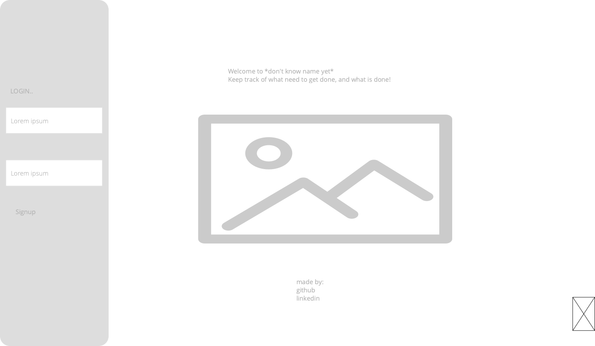
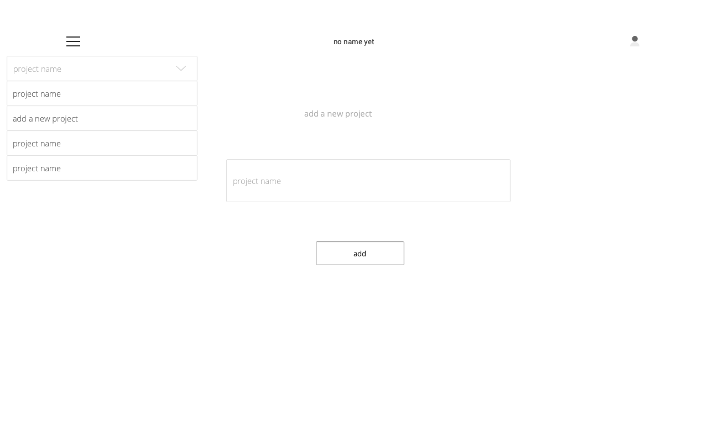
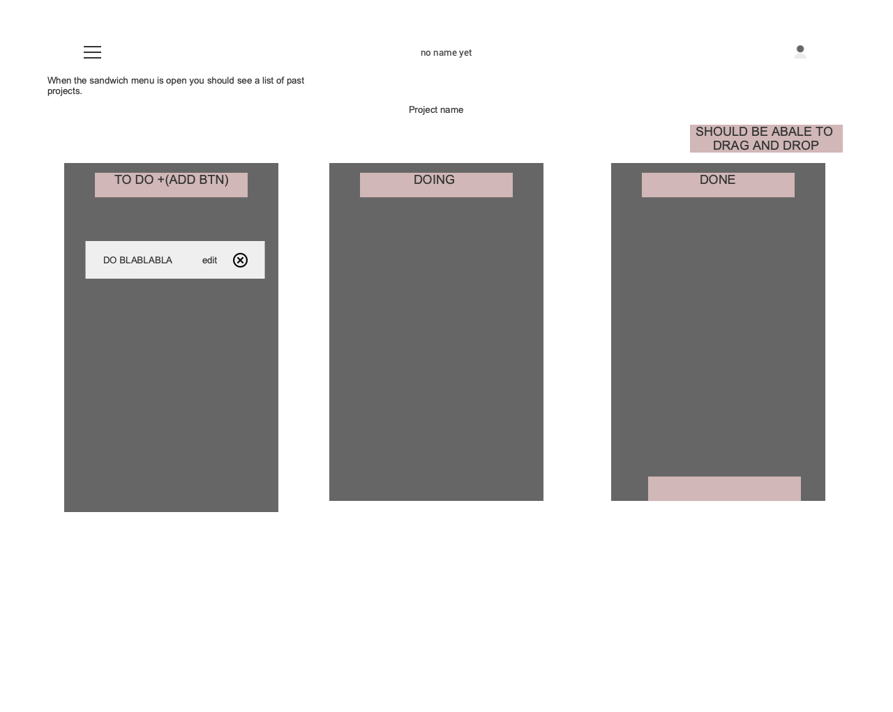
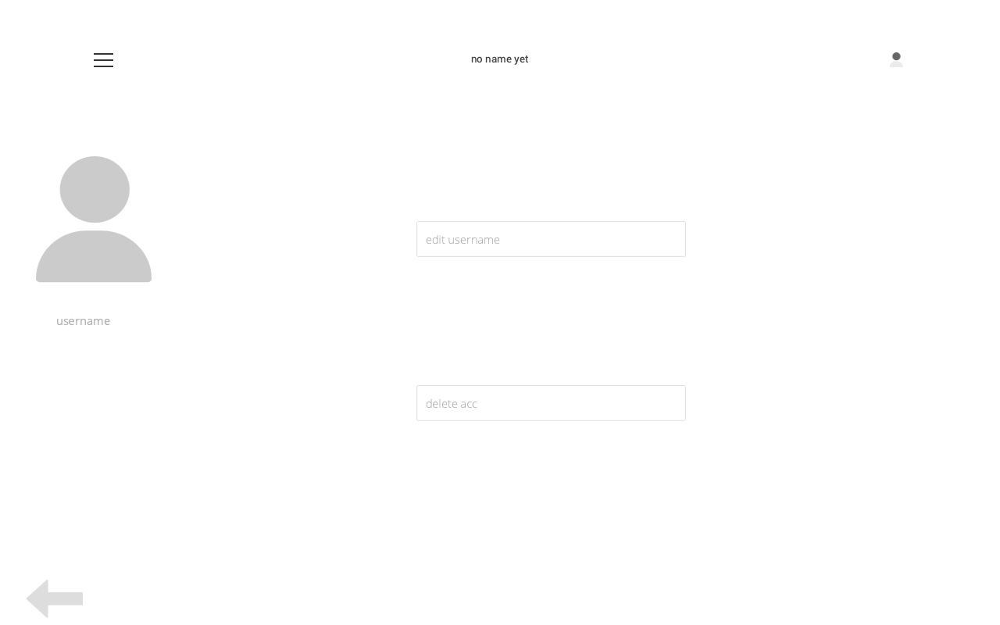

# KanBan APP

#### An applicatipn in wich users are able to track the workflow of their projects.

# Models

### LOGIN/SIGNUP

username = models.CharField(max_lenght=20)

passowrd = models.CharField(max_lenght=20)

### MAIN PROJECTS

title = models.CharField(max_lenght=100)

type = models.CharField(max_lenght=50)

### sub projects

name = models.charField(max_lenght=200)

description = models.CharField(max_lenght=1000)
mainProjectNum = models.CharField(max_lenght=10)

# Route Table

| url           | method | action                            |
| ------------- | ------ | --------------------------------- |
| /             | get    | shows homepage with a login route |
| /             | post   | login route                       |
| /signp        | post   | signup route                      |
| /project      | Post   | add a main project                |
| /project/:id  | get    | shows sub projects                |
| /project/:id  | post   | add sub project                   |
| /project/:id  | delete | delete sub project                |
| /project/:id  | put    | update sub project                |
| /project/user | put    | edit username                     |

# user stories

- As a user I can create and account
- As a user i can login to said account and logout
- As a user i can add/edit/delete a project
- As a user i can view said project in my drop down menu
- as a user when i click on said project i'm lead to a page inwhich i can add sub projects
- as a user i can add,view,edit and delte a sub project
- as a user i can add multi sub projects to a main project
- as a user i can drap and drop a subproject

# componnents map

soon!

# Technologies

## backend

Python
Django /Django restapi
postgres

## frontend

JS
CSS
React or Svelte

# problems?
-getting my li to be droppable
# wireframe

